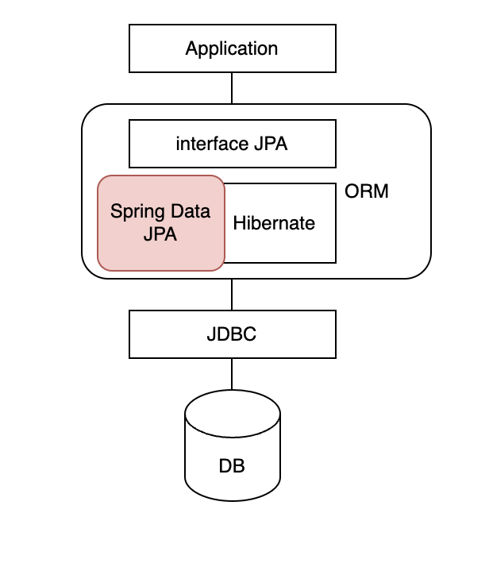

# JPA
---
1. ORM(Object Relational Mapping)
2. JPA(Java Persistence API)
3. Spring Data JPA
4. 영속성 관리
5. Entity Life Cycle (엔티티 생명주기)
##### `jpa-project-example` project 참고
---


### 1. ORM(Object Relational Mapping)
사용자들에게 지속적으로 서비스를 제공하기 위해서는 영구적인 데이터 관리가 필요하다. RDBMS로 Oracle, Mysql, Postgre 등 다양한 제품들이 있는데 이를 공통적으로 사용할 수 있도록 자바에서는 JDBC라는 스펙을 제공한다. 자바 애플리케이션은 JDBC API를 이용해서 SQL을 데이터베이스에 전달하고 결과를 반환 받는다. 
JDBC로도 개발할 수 있지만 비즈니스 로직이 자바 코드 보다는 Query에 집중되고, 자바를 Query 매핑하는 용도로 많이 사용하게 된다. 비즈니스 로직이 복잡해지면서 SQL Mapper(Mybatis, JdbcTemplate)를 사용하였지만 자바의 객체랑 구조화된 데이터 사이 간에 불일치는 여전히 문제였다.
이 불일치를 해결하기 위해 ORM이 등장하였는데, 자바에서 무엇보다 중요한 **객체와 데이터베이스 사이의 관계를 연결(매핑)해주는 것**으로, 객체 중심 설계에 집중할 수 있다.

### 2. JPA (Java Persistence API)
엔터프라이즈 개발을 위해 과거에 EJB(Enterprise Java Beans)라는 기술을 사용했는데, 거기엔 엔티티빈이라는 ORM 기술이 포함 되어있었지만 복잡하여 사용빈도가 낮았다. 이 때, Hibernate라는 ORM 프레임워크가 등장했는데 EJB의 엔티티빈보다 호응이 좋았는지 EJB 3.0에서 Hibernate 기반으로 새로운 자바 ORM 기술을 만들었는데 그것이 JPA이다. 
'자바 진영의 ORM 기술 표준으로 인터페이스를 모아둔 것'으로 정의할 수 있는데, 쉽게 표현하자면 **자바에서 사용하는 ORM 기술**이라고 생각하면 된다. 
개발자가 직접 쿼리문을 작성하지 않아도 자동으로 쿼리문을 만들어 데이터베이스에 전달하고, 그 결과를 반환받을 때, 자동으로 데이터를 객체에 맞게 매핑을 해준다. 
JPA는 데이터에 접근하기 위한 API라 인터페이스로 되어있고 JPA의 구현체로는 Hibernate, EclipseLink, DataNucleus가 있다. 스프링에서는 Spring Data JPA로 제공한다.
JPA는 자바 애플리케이션과 JDBC 사이에서 동작한다. 

### 3. Spring Data JPA
스프링에서 Hibernate를 간편하게 사용할 수 있게 묶어서 제공하는 것이 Spring Data JPA이다. 즉, EntityManager를 직접적으로 사용하지 않고 데이터 접근이 쉽도록 **CRUD의 공통 인터페이스를 제공**한다.



즉, 
1. 애플리케이션과 데이터베이스를 연결하는 건 ORM
2. 자바에서 ORM 인터페이스를 제공하는 건 JPA
3. JPA의 구현 클래스를 모아둔 것이 Hibernate인데 그 중에 CRUD와 같이 사용빈도가 높고 자주 사용하는 것들을 스프링에서 제공하는 건 Spring Data JPA

### 4. 영속성 관리
#### 1. `jpa-project-example` project 통해서 알아본 JPA 동작방식
- build.gradle
```groovy
plugins {
    id 'java'
}

group 'com.sjkim'
version '1.0-SNAPSHOT'

repositories {
    mavenCentral()
}

dependencies {
    implementation 'org.hibernate:hibernate-entitymanager:5.4.13.Final' // JPA + Hibernate
    runtimeOnly 'com.h2database:h2:2.1.212'

    compileOnly 'org.projectlombok:lombok:1.18.24'
    annotationProcessor 'org.projectlombok:lombok:1.18.24'

    implementation 'org.slf4j:slf4j-api:1.7.36'
    implementation 'org.slf4j:slf4j-log4j12:1.7.36'

    testImplementation 'org.junit.jupiter:junit-jupiter-api:5.8.2'
    testRuntimeOnly 'org.junit.jupiter:junit-jupiter-engine:5.8.2'
    testImplementation 'org.projectlombok:lombok:1.18.24'
    testAnnotationProcessor 'org.projectlombok:lombok:1.18.24'
    testImplementation 'org.hamcrest:hamcrest-all:1.3'
    testImplementation 'org.assertj:assertj-core:3.21.0'
}

test {
    useJUnitPlatform()
}
```
1. `persistence.xml` 설정 정보를 통해서 EntityManagerFactory 생성
    - EntityManagerFactory는 한번 생성시 초기비용이 크므로 EntitiyManager끼리 공유됨
    ```xml
    <?xml version="1.0" encoding="UTF-8"?>
    <persistence version="2.2" xmlns="http://xmlns.jcp.org/xml/ns/persistence"
                xmlns:xsi="http://www.w3.org/2001/XMLSchema-instance"
                xsi:schemaLocation="http://xmlns.jcp.org/xml/ns/persistence http://xmlns.jcp.org/xml/ns/persistence/persistence_2_2.xsd">
        <!-- 데이터베이스당 하나의 영속성 유닛 -->
        <persistence-unit name="jpa_study"> 
            <class>jpa_study.start.Board</class>
            <properties>
                <property name="javax.persistence.jdbc.driver" value="org.h2.Driver"/>
                <property name="javax.persistence.jdbc.url" value="jdbc:h2:tcp://localhost/~/dev/temp/h2db/entity"/>
                <property name="javax.persistence.jdbc.user" value="sa"/>
                <property name="javax.persistence.jdbc.password" value=""/>
                <property name="hibernate.dialect" value="org.hibernate.dialect.H2Dialect"/>
                <property name="hibernate.hbm2ddl.auto" value="create"/>

                <!-- 초기 데이터 insert -->
                <property name="javax.persistence.sql-load-script-source" value="./META-INF/data.sql"/>

                <property name="hibernate.show_sql" value="true"/>
                <property name="hibernate.format_sql" value="true"/>
            </properties>
        </persistence-unit>
    </persistence>
    ```
    ```java
    EntityManagerFactory entityManagerFactory = Persistence.createEntityManagerFactory("jpa_study");
    ```
2. EntityManagerFactory를 통해서 EntityManager 생성
    - 영속성 컨텍스트에 Entity 저장 → CRUD 가능하도록 관리
    ```java
    EntityManager entityManager = entityManagerFactory.createEntityManager();
    ```
3. EntityManager를 통해 트랜잭션 얻음
    ```java
    EntityTransaction entityTransaction = entityManager.getTransaction();
    ```
4. 트랜잭션 begin, logic 수행, commit
5. EntityManager, EntityManagerFactory를 종료
    ```java
    entityManager.close();
    entityManagerFactory.close();
    ```
#### 2. Persistence Context(영속성 컨텍스트)
- **Entity 저장공간**
- EntityManager로 Entity를 `persist()` 또는 `find()` 할 경우 영속성 컨텍스트에 저장됨
- 기능: 1차 캐시, 쓰기지연, 변경감지 등

##### Entity Cache 1차 캐시
- 영속성 컨텍스트 내에 존재하는 캐싱 기능
- **Map(ID, Entity)** 구조
- ID로 조회시 영속시 컨텍스트 내에 캐시로 존재한다면 DB 조회 없이 해당 Entity를 리턴하고, 없으면 DB 조회 후 1차 캐시에 저장한 뒤에 리턴 → 성능 개선

##### Transactional write-behind 쓰기지연
- `persist()` 호출 후 1차 캐시 때 캐싱하면서 Query를 만들어 SQL 저장소에 보관
- `commit()` 하기 전까지 Query를 영속성 컨텍스트 내 SQL 저장소에 모아둔다.
- flush 할 때 SQL 저장소에 모인 Query를 DB에 보내며 이후에 DB commit 발생

#### 3. Flush
- **영속화 (영속성 컨텍스트를 DB에 반영)**
    1. `flush()` 명시적 호출
    2. 트랜잭션 commit시 auto flush 발생 (`@Transactional`)
    3. JPQL 쿼리 실행시

### 5. Entity Life Cycle (엔티티 생명주기)


#### 1. new/transient 비영속상태
- POJO
- 객체만 생성했을 경우
- 영속성 컨텍스트는 대상 Entity를 관리하지 않음
```java
@Test
@DisplayName("비영속")
@Tag("skipAfterEach")
void newState() {
    entityTransaction.begin();
    Board board = Board.builder()
            .title("TITLE")
            .content("CONTENT")
            .writer("WRITER")
            .build();
    var result = entityManager.contains(board);
    assertThat(result).isFalse();
}
```

#### 2. managed 영속상태
- **영속성 컨텍스트는 대상 Entity를 관리하고 있음**
- `persist()` 호출로 영속상태로 변경
- commit 하지 않으면 DB에 반영되지 않음 (즉, `persist()`호출한다고 해서 DB에 반영되는 게 아님)
    ``` java
    @Test
    @DisplayName("영속. 커밋하지 않을 경우")
    @Tag("skipAfterEach")
    void managedStateNotCommit() {
        String title = "TITLE";
        entityTransaction.begin();
        Board board = Board.builder()
                .title(title)
                .content("CONTENT")
                .writer("WRITER")
                .build();
        entityManager.persist(board); // managed.
        var result = entityManager.contains(board);
        assertThat(result).isTrue();

        // 영속 엔티티 조회
        Board resultBoard = entityManager.find(Board.class, 2001L); 
        assertThat(resultBoard.getTitle()).isEqualTo(title);
        // commit 하지 않아서 DB에는 데이터 없는 상태

        // entityTransaction.commit();
    }
    ```
- `find()`도 동일하게 영속상태로 변경
    ```java
    @Test
    @DisplayName("영속. find()")
    void managedStateWhenFind() {
        entityTransaction.begin();
        Board resultBoard = entityManager.find(Board.class, 1000L);
        var result = entityManager.contains(resultBoard);
        assertThat(result).isTrue();
    }
    ```

##### DirtyCheck 변경감지 
```java
@Test
@DisplayName("변경감지")
void dirtyChecking() {
//        entityTransaction.begin();
    Board resultBoard = entityManager.find(Board.class, 1000L); // 스냅샷 & 캐싱
    assertThat(resultBoard.getTitle()).isEqualTo("1000_TITLE");

    String changedTitle = "UPDATED_TITLE";
    resultBoard.changeTitle(changedTitle);

    Board resultBoard2 = entityManager.find(Board.class, 1000L); // 1차 캐시에 들어있는 엔티티
    assertThat(resultBoard2.getTitle()).isEqualTo(changedTitle);

    log.info(">>>> tx begin");
    entityTransaction.begin();
    log.info(">>>> tx commit");
    entityTransaction.commit(); 
    // 기본은 entity 모든 필드 업데이트. 
    // @DynamicUpdate로 동적 쿼리 실행: 변경 감지된 필드만 업데이트 된다.
}
```
``` text
Hibernate: 
    select
        board0_.id as id1_0_0_,
        board0_.content as content2_0_0_,
        board0_.created_at as created_3_0_0_,
        board0_.title as title4_0_0_,
        board0_.updated_at as updated_5_0_0_,
        board0_.writer as writer6_0_0_ 
    from
        board board0_ 
    where
        board0_.id=?
2022-05-24 23:39:40 INFO >>>> tx begin
2022-05-24 23:39:40 INFO >>>> tx commit
Hibernate: 
    update
        board 
    set
        title=?,
        updated_at=? 
    where
        id=?
2022-05-24 23:39:41 INFO em, emf close
```
- 1차 캐시로 인해 select는 처음 한번만 발생한다.
- `persist()`나 update 메소드 호출이 없이 `changeTitle()` 필드 변경만 있어도 저장이 되는 현상이 발생한다. 즉, **Entity가 변경되는 경우에 save 또는 update 메소드를 호출하지 않더라도 commit시 DB 반영이 이루어진다.**
- 대상 Entity는 영속성 컨텍스트에 처음 로드될 때 스냅샷을 가지게 된다. 트랜잭션 commit이 발생한 후(flush 시점에) 스냅샷과 변경된 Entity를 비교하여 변경된 사항이 있으면 update Query를 생성하여 SQL 저장소에 보관한다. SQL 저장소에 있는 update Query를 DB에 전달하며 DB commit이 발생되면 변경된 사항이 DB에 반영된다.

#### 3. detached 준영속상태
- 영속상태 Entity를 영속성 컨텍스트가 더이상 관리하지 않는 상태 → **영속성 컨텍스트의 기능이 동작하지 않음**
##### detached: 준영속 전환
- Spring Data JPA에서는 따로 메소드를 제공하지 않는다.
```java
@Test
@DisplayName("준영속. 변경감지 되지 않음")
void detachedState_4() {
    entityTransaction.begin();
    Board resultBoard = entityManager.find(Board.class, 1000L);
    resultBoard.changeTitle("UPDATE");
    entityManager.detach(resultBoard); // detached

    var resultAfterDetach = entityManager.contains(resultBoard);
    assertThat(resultAfterDetach).isFalse();
    entityTransaction.commit();
    // DB 조회 - title은 변경되지 않음
}
```

##### clear: 영속성 컨텍스트 초기화
```java
@Test
@DisplayName("준영속. clear()")
void detachedState_1() {
    entityTransaction.begin();
    Board resultBoard = entityManager.find(Board.class, 1000L); // managed
    entityManager.clear(); // detached
    resultBoard.changeTitle("UPDATE");
    var resultAfterClear = entityManager.contains(resultBoard);
    assertThat(resultAfterClear).isFalse();
    entityTransaction.commit();
}
```
##### close: EntityManager 종료
```java
@Test
@DisplayName("준영속. close()")
@Tag("skipAfterEach")
void detachedState_3() {
    Board resultBoard = entityManager.find(Board.class, 1000L);
    entityManager.close(); // Session/EntityManager is closed
    var resultAfterClose = entityManager.isOpen();
    assertThat(resultAfterClose).isFalse();
}
```
##### merge: 병합
```java
private Board mergeForDetached2() {
    var entityManager = entityManagerFactory.createEntityManager();
    var entityTransaction = entityManager.getTransaction();
    entityTransaction.begin();
    var board = entityManager.find(Board.class, 1000L); // managed
    entityManager.detach(board); // detached
    entityTransaction.commit();
    log.info("board isContains {}", entityManager.contains(board));
    entityManager.close();
    return board;
}
```
- Board Entity는 준영속상태가 된다.

```java
@Test
void mergeTest2() {
    var board = mergeForDetached2();
    board.changeTitle("UPDATE_TITLE");
    mergeForManaged2(board);
}
```
```java
private Board mergeForManaged2(Board board) {
    var entityManager = entityManagerFactory.createEntityManager();
    var entityTransaction = entityManager.getTransaction();
    entityTransaction.begin();
    var mergedBoard = entityManager.merge(board); // 영속상태로 변경
    log.info("board isContains {}, {}", entityManager.contains(board), board.getTitle());
    log.info("mergedBoard isContains {}, {}", entityManager.contains(mergedBoard), board.getTitle()); 
    // 다른 board로써 새로운 영속상태의 entity
    entityTransaction.commit(); // dirtyCheck
    entityManager.close();
    return mergedBoard;
}
```
- `merge()` 호출 후 준영속 Entity의 id로 1차 캐시에서 조회 (또는 DB에서 조회 후 캐시에 저장)된다. 조회된 Entity에 이전 Board Entity 데이터를 병합시킨다. 이전 Board Entity의 변경사항도 함께 merge 된다. 
- 리턴값은 이전 Entity가 아닌 조회된 영속상태 Entity이다.

#### 4. removed 삭제된상태
- Entity를 영속성 컨텍스트에서 삭제하고 데이터베이스에서도 삭제
- delete query가 실행됨
```java
@Test
@DisplayName("삭제")
void removedState() {
    entityTransaction.begin();
    Board resultBoard = entityManager.find(Board.class, 1000L);
    entityManager.remove(resultBoard);
    var result = entityManager.contains(resultBoard);
    assertThat(result).isFalse();
    entityTransaction.commit();
    // DB 조회 - 해당 레코드 deleted
}
```
---
> https://thorben-janssen.com/entity-lifecycle-model/
> https://www.baeldung.com/hibernate-entitymanager
> 자바 ORM 표준 JPA 프로그래밍
> 스프링부트로 배우는 자바웹개발