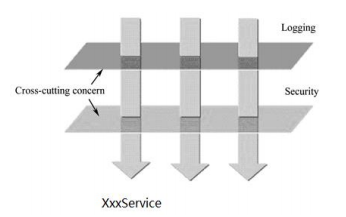
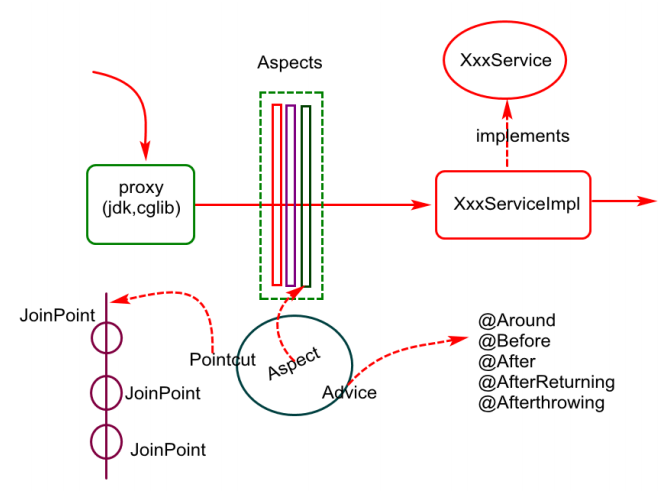

# Spring AOP

---

1. AOP(Aspect Oriented Programming)
2. 용어
3. Spring의 AOP
4. Advice 종류
5. TEST CASE
6. 실무적용 TEST
##### `spring-boot-jpa` project 참고

---

### 1. AOP(Aspect Oriented Programming)



위의 그림을 살펴보면 각각의 비즈니스 로직마다 Logging, Security 등 **공통적인 기능이 요구**되는 경우가 있다. **로깅, 권한, 캐싱, 공통 예외처리, 메서드 실행시간 체크, 메서드 파라미터 validate check, 보안, 트랜잭션** 등 애플리케이션 전반적으로 필요한 경우가 대부분이다. 하지만 공통 기능을 해당 로직에 계속 추가하는 건 중복 코드를 양산할 수 있는데 이를 해결하기 위해 AOP가 나타났다.
위의 공통적 기능들은 핵심 비즈니스 로직은 아니지만 **공통 관심사 cross-cutting concern**으로 분리하여 작성할 수 있다. 또는 위의 그림처럼 횡으로 분리하였다고 하여 횡단 관심사라고도 한다.
즉, **공통 관심사를 모듈로 분리하는 것이 AOP**이다. AOP 장점으로 아래와 같다.

1. 중복 코드 제거
2. 공통 관심사를 분리하여 개발자가 핵심 비즈니스 로직에만 집중
3. 공통 관심사의 유지보수 수월

### 2. 용어
AOP에 사용되는 용어를 살펴보자.
|용어|설명|
|--|--|
|Aspect|공통 관심사|
|Advice|Aspect를 구현한 것으로 공통 관심사를 언제 적용할지 정의함. 공통 관심사를 가지고 있는 클래스|
|Target|핵심 로직을 가진 객체|
|Joinpoint|Target 내 여러 메서드|
|Pointcut|핵심 로직과 공통 관심사가 결합되는 지점을 결정|
|Weaving|Advice를 핵심 로직에 적용하는 것|

### 3. Spring의 AOP
Spring에서는 OOP를 보완하는 의미로 사용되어 Spring Container가 AOP에 의존하지 않도록 제공한다.



1. Spring 설정 파일에서 Bean으로 등록된 Target의 Proxy 객체를 만든다. 핵심 로직을 가진 객체(Target)을 감싸는 것을 Proxy라고 한다.
2. 핵심 코드에서 공통 관심사(공통 모듈)을 직접적으로 호출하지 않으며, Proxy로 간접적으로 접근하여 호출 (Proxy를 이용하므로 메서드 호출에서만 AOP를 사용할 수 있다.)
3. Advice에 정의된 대로, 공통 기능을 실행한 뒤 Target의 메서드를 실행하거나 Target의 메서드를 호출한 뒤 공통 기능을 실행한다.
4. 핵심 코드(개발자의 코드)와 공통 관심사를 구현한 코드를 실행 시점에 결합시킨다. (Spring AOP의 경우 런타임 시에 Weaving)
 

### 4. Advice 종류

|종류|설명|
|--|--|
|Before Advice|Target의 메서드 실행 전에 공통 기능 실행|
|After Advice| Target의 메서드 실행 도중 예외가 발생하든 하지않든 공통 기능 실행|
|After Returning Advice| Target의 메서드 예외 발생없이 실행 이후 공통 기능 실행|
|After Throwing Advice| Target의 메서드 실행 도중 예외가 발생한 경우 공통 기능 실행|
|Around Advice|Target의 메서드 실행 전, 후, 예외 발생 시 공통 기능 실행. 메서드 실행 주변(around)에 Advice가 적용 → 메서드 실행 제어 가능|


### 5. TEST CASE 1
``` groovy
dependencies {
    implementation 'org.springframework.boot:spring-boot-starter-aop'
}
```
- build.gradle에 추가
#### (TestAdvisor) Before, After, AfterReturning, AfterThrowing
``` java
@Aspect
@Component
@Order(1)
public class TestAdvisor {

    @Pointcut("execution(* com.sjkim.springbootjpa.service.SomethingService.*(..))")
    private void testPointcut() {
    }

    @Before(value = "testPointcut()")
    public void before(JoinPoint joinPoint) throws IOException {
        var methodSignature = (MethodSignature) joinPoint.getSignature();
        System.out.println("====== Before Advice ============");
        var method = methodSignature.getMethod();
        System.out.println("method : " + method);

        for (var param : methodSignature.getParameterNames()) {
            System.out.println("methodSignature paramName : " + param);
        }

        for (var param : method.getParameters()) {
            System.out.println("method paramName : " + param.getName());
            System.out.println("method paramType : " + param.getType());
        }

        var args = joinPoint.getArgs();
        for (var arg : args) {
            System.out.println("joinPoint arg : " + arg); // 인자값으로 어떤 처리를 할 때 사용
            System.out.println("joinPoint arg className : " + arg.getClass().getSimpleName());
        }
    }

    @After(value = "testPointcut()")
    public void after(JoinPoint joinPoint) {
        System.out.println("====== After Advice ============");
        System.out.println("예외가 발생하든 하지 않든 반드시 실행됨");
    }

    @AfterReturning(value = "testPointcut()", returning = "returnObj")
    public void afterReturn(JoinPoint joinPoint, Object returnObj) {
        System.out.println("====== After Returning Advice ============");
        System.out.println("예외가 발생하면 실행되지 않음");
        System.out.println("returnObj: " + returnObj);
    }

    @AfterThrowing(value = "testPointcut()", throwing = "throwable")
    public void afterThrowing(JoinPoint joinPoint, Throwable throwable) {
        System.out.println("====== After Throwing Advice ============");
        System.out.println("예외가 발생하면 실행됨");
        System.out.println("throwable class: " + throwable.getClass());
        System.out.println("throwable message: " + throwable.getMessage());
        System.out.println("throwable cause: " + throwable.getCause());
    }
}
```
- `@Aspect`으로 Spring AOP 구성을 위한 Aspect임을 클래스에 명시하며, Bean으로 등록하기 위해 `@Component`을 추가한다. 
- `@Pointcut`으로 다양한 표현식을 통해 Advice를 어떤 JoinPoint에 결합시킬 것인지 결정하게 된다.
    - `@Pointcut("execution(* com.sjkim.springbootjpa.service.SomethingService.*(..))")`는 해당 패키지 아래 SomethingService 내 모든 메서드에 Advice를 적용하겠다는 의미이다.
#### (TimerAdvisor) Around Advice
- Timer의 시작 및 중지
``` java
@Target({ElementType.METHOD})
@Retention(RetentionPolicy.RUNTIME)
public @interface Timer {
    String message() default "";
}
```
``` java
@Aspect
@Component
public class TimerAdvisor {

    @Pointcut(value = "@annotation(com.sjkim.springbootjpa.aop.Timer)")
    private void timerPointcut() {
    }

    @Around("timerPointcut()")
    public Object timerAround(ProceedingJoinPoint pjp) throws Throwable {
        System.out.println("====== Around Advice ============");
        var stopWatch = new StopWatch();
        stopWatch.start();
        var result = pjp.proceed();
        stopWatch.stop();
        System.out.println("==============> [Timer] " + stopWatch.getTotalTimeSeconds());

        // Annotation Timer에서 element 가져오기
        var methodSignature = (MethodSignature) pjp.getSignature();
        var method = methodSignature.getMethod();
        var annotation = method.getAnnotation(Timer.class);
        System.out.println(annotation.message());

        return result; // Object를 Return 하지 않으면 @Timer가 적용된 메서드에서는 null을 반환함.
    }
}
```
- `@Pointcut(value = "@annotation(com.sjkim.springbootjpa.aop.Timer)")`은 해당 Annotation(`@Timer`)가 선언된 메서드에 Advice를 적용하겠다는 의미이다.
##### 예외 발생하지 않음
- 예외가 발생하지 않는 method 작성한다고 가정
``` java
@Timer(message = "Timer Test")
public String getSomething(int intValue, String stringValue, SomethingRequest request) throws InterruptedException {
    System.out.println("==============> start getSomething");
    Thread.sleep(2000);
    System.out.println("==============> end getSomething");
    return request.getMessage();
}
```
- test code
``` java
@Test
@SneakyThrows
void getSomething() {
    var value = "MESSAGE";
    SomethingRequest request = new SomethingRequest(value);
    var result = somethingService.getSomething(10, "TEST", request);
    assertThat(result).isEqualTo(value);
}
```
- 결과
    - Before → Around → After Returning → After 순으로 동작
``` text
====== Before Advice ============
method : public java.lang.String com.sjkim.springbootjpa.service.SomethingService.getSomething(int,java.lang.String,com.sjkim.springbootjpa.dto.SomethingRequest) throws java.lang.InterruptedException
methodSignature paramName : intValue
methodSignature paramName : stringValue
methodSignature paramName : request
method paramName : intValue
method paramType : int
method paramName : stringValue
method paramType : class java.lang.String
method paramName : request
method paramType : class com.sjkim.springbootjpa.dto.SomethingRequest
joinPoint arg : 10
joinPoint arg className : Integer
joinPoint arg : TEST
joinPoint arg className : String
joinPoint arg : SomethingRequest(message=MESSAGE, timeStamp=2022-04-19T00:02:13.854357)
joinPoint arg className : SomethingRequest
====== Around Advice ============
==============> start getSomething
==============> end getSomething
==============> [Timer] 2.032024125
Timer Test
====== After Returning Advice ============
예외가 발생하면 실행되지 않음
returnObj: MESSAGE
====== After Advice ============
예외가 발생하든 하지 않든 반드시 실행됨
```

##### 예외 발생
#### 
- 예외가 발생하는 method 작성한다고 가정
``` java
public void occurException() {
    throw new RuntimeException("TestAdvisor Test 위한 예외 발생");
}
```
- test code
``` java
@Test
void occurException() {
    assertThrows(RuntimeException.class, () -> {
        somethingService.occurException();
    });
}
```
- 결과
    - Before → After Throwing → After 순으로 동작
    - After Throwing Advice: `throwing` 옵션을 통해 예외 발생시 공통된 처리를 할 수 있다
    - After Advice: 예외가 발생하든 발생하지 않든 반드시 실행된다.
``` text
====== Before Advice ============
method : public void com.sjkim.springbootjpa.service.SomethingService.occurException()
====== After Throwing Advice ============
예외가 발생하면 실행됨
throwable class: class java.lang.RuntimeException
throwable message: TestAdvisor Test 위한 예외 발생
throwable cause: null
====== After Advice ============
예외가 발생하든 하지 않든 반드시 실행됨
```
### 6. TEST CASE 2
- 암호화된 데이터가 들어와 복호화시킨 후, 사용자 가입 처리를 하고 다시 암호화하여 응답한다고 가정할 때..
- 여기서는 Base64를 예로 들어 작성하였다.  
``` java
@Target({ElementType.METHOD})
@Retention(RetentionPolicy.RUNTIME)
public @interface Decoder {

}
```
``` java
@Aspect
@Component
public class DecoderAdvisor {

    @Pointcut(value = "@annotation(com.sjkim.springbootjpa.aop.Decoder)")
    private void decodePointcut() {
    }

    @Before(value = "decodePointcut()")
    public void before(JoinPoint joinPoint) throws IOException {
        var args = joinPoint.getArgs();
        for (var arg : args) {
            convertBase64(arg, (value) -> {
                return new String(Base64.getDecoder().decode(value), StandardCharsets.UTF_8);
            });
        }
    }

    @AfterReturning(value = "decodePointcut()", returning = "returnObj")
    public void afterReturn(JoinPoint joinPoint, Object returnObj) {
        if (returnObj instanceof UserInfo) {
            convertBase64(returnObj, (value) -> {
                return Base64.getEncoder().encodeToString(value.getBytes(StandardCharsets.UTF_8));
            });
        }
    }

    private void convertBase64(Object obj, Base64Convertor convertor) {
        var userInfo = (UserInfo) obj;
        var convertedName = convertor.convert(userInfo.getName());
        var convertedEmail = convertor.convert(userInfo.getEmail());
        userInfo.setName(convertedName);
        userInfo.setEmail(convertedEmail);
        System.out.println("========== convertBase64 : " +  userInfo);
    }

    interface Base64Convertor {
        String convert(String value);
    }
}
```
```java
@Decoder
public UserInfo registerUser(UserInfo userInfo) {
    // register process ...
    System.out.println(userInfo + " in method");
    return userInfo;
}
```
- Before Advice에서 Arguments(사용자 정보)를 복호화한 뒤, 핵심 로직에서 가입 절차를 거치고 정상적으로 실행이 되었을 때 리턴된 데이터를 After Returning Advice에서 다시 암호화하여 보내는 방식으로 구현할 수 있다.
---
> https://programmer.group/simple-spring-aop-steps.html 
> https://docs.spring.io/spring-framework/docs/current/reference/html/core.htm
> https://engkimbs.tistory.com/746
> 코드로 배우는 스프링 웹 프로젝트
> Spring 4.0 프로그래밍
