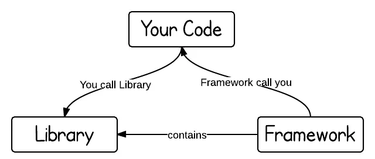
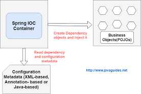

# IoC & DI

---

1. IoC(Inversion of Control)
2. DI(Dependency Injection)
3. BeanFactory, ApplicationContext
4. Bean 등록
5. Bean 사용

---

#### 1. IoC(Inversion of Control)

1. 제어의 역전
   - 프로그래머가 작성한 코드가 라이브러리 코드를 호출
   - 제어의 역전이 적용이 되면 외부 코드가 프로그래머가 작성한 코드를 호출 : 프레임워크
     
2. 왜 사용하는가?
   - X는 Y에 의존, Y는 Z에 의존... 의존성이 꼬이고, 클래스 간 긴밀하게 의존하는 상태 → `Dependency rot`
   - 한 클래스에 변경사항이 있으면 서로 결합되어 있으므로 관련된 코드 모두 수정해야 함
   - Decoupling. 클래스 간의 관계를 유연하게 하고 재사용성을 높인다.
3. Hollywood Principle
   - > 헐리우드 원칙을 사용하면, 저수준 구성요소에서 시스템에 접속을 할 수는 있지만, 언제 어떤 식으로 그 구성요소들을 사용할지는 고수준 구성요소에서 결정하게 됩니다. 즉, 고수준 구성요소에서 저수준 구성요소에게 "먼저 연락하지 마세요. 제가 먼저 연락 드리겠습니다"라고 얘기를 하는 것과 같죠. (Don't call us, we'll call you).  
     > -Head First Design Patterns
   - IoC를 구현할 수 있는 방법은 많이 있고 그 중에 한 방법이 DI
4. Spring에서는 객체의 생명주기를 프로그래머의 코드가 아닌 컨테이너가 직접 담당 → IoC Container. 제어권이 Container로 넘어감.
   <br>

#### 2. DI(Dependency Injection)


```text
- Dependency : Bean A는 Bean B에 의존
- Injection : 외부(Bean Container)에서 넣어 줌
- Bean Container가 DI를 통해 의존성을 주입하여 IoC를 구현함
```

1. 의존성 주입
   - Bean간 의존관계가 내부가 아닌 외부 설정파일을 통해 정의
   - 외부 설정 정보에 등록된 Bean 간의 의존관계를 컨테이너가 자동적으로 연결
   - Spring의 IoC container의 역할
2. 의존성 주입 방법
   - Setter Injection (setter 메소드를 이용한 주입)
   ```java
   public class WorkService {
       private Worker worker;
       public void setWorker(Worker worker){
           this.worker = worker;
        }
        public void ask() {
            System.out.println(worker.getRole());
        }
    }
   ```
   - Constructor Injection (생성자를 이용한 주입)
   ```java
   public class WorkService {
       private Worker worker;
       public WorkService(Worker worker) {
           this.worker = worker;
        }
        public void ask() {
            System.out.println(worker.getRole());
        }
   }
   ```
   <br>

#### 3. BeanFactory, ApplicationContext

1. IoC Container
   - IoC를 담당하는 컨테이너는 BeanFactory, ApplicationContext
   - 설정 정보를 읽어와서 인스턴스를 생성하고 각 인스턴스를 연결한 뒤에 내부적으로 보관
2. BeanFactory
   - Spring IoC Container의 interface
   - Bean의 생명주기를 관리
3. ApplicationContext
   - BeanFactory의 상속을 받음
   - BeanFactory에서 제공하는 기능 이외에 부가적인 기능 지원
   - 필요한 빈을 생성하고 주입해주는 역할
   - 외부 설정에 등록된 빈끼리만 의존성 주입을 지원

```text
* POJO (Plain Old Java Object)
    - EJB에서 사용된 무겁고 복잡한 코드에 대한 반발로 등장
    - 특정 라이브러리나 기술에 종속적이지 않은 순수 Java 객체
* Java Beans
    - getter, setter 사용
    - 인수 없는 생성자
    - Serializable 구현 (네트워크를 통해 외부에 Java 객체를 전송하는 경우)
* Spring Bean
    - Spring IoC Container에서 관리되는 객체
```

<br>

#### 4. Bean 등록

1.  xml 외부 설정파일 이용

    - applicationContext.xml 파일 생성

    ```xml
    <?xml version="1.0" encoding="UTF-8"?>
    <beans xmlns="http://www.springframework.org/schema/beans"
      xmlns:xsi="http://www.w3.org/2001/XMLSchema-instance"
      xmlns:context="http://www.springframework.org/schema/context"
      xsi:schemaLocation="http://www.springframework.org/schema/beans
       http://www.springframework.org/schema/beans/spring-beans.xsd
       http://www.springframework.org/schema/context
       http://www.springframework.org/schema/context/spring-context.xsd">

       <!-- bean 태그는 Bean으로 등록할 객체 -->
       <!-- bean 태그의 id는 주로 클래스의 소문자 형태로 입력 -->
       <bean id="boss" class="com.sjkim.xml_company.Boss"/>
       <bean id="employee" class="com.sjkim.xml_company.Employee"/>
       <bean id="workService" class="com.sjkim.xml_company.WorkService">
           <!-- 1. Constructor Injection -->
           <constructor-arg ref="boss" index="0"/> <!-- index는 인자 순서 -->
           <!-- 2. Setter Injection 이용 -->
           <property name="worker" ref="boss"/>
       </bean>
    </beans>
    ```

2.  Java Code 이용 (Java Config)

    - @Configuration : 설정 정보 사용
    - @Bean : Container에 Bean으로 등록

    ```java
    @Configuration
    public class BeanConfig {

        @Bean
        public Worker boss() {
            return new Boss();
        }

        @Bean
        public Worker employee() {
            return new Employee();
        }

        @Bean
        public WorkService workService() {
            WorkService workService = new WorkService();
            workService.setWorkManager(new Boss());
            return workService;
        }
    }
    ```

3.  Annotation : Component Scanning - @ Component - @Repository, @Service, @Controller : 레이어에 따라서 지정

    ```java
    @Configuration
    @ComponentScan(basePackages = "com.sjkim.zoo3")
    public class BeanConfig {

    }
    ```

    <br>

#### 5. DI를 통한 Bean 사용

1.  Setter Injection
2.  Constructor Injection
    - 생성자의 인수가 하나일 때 @Autowired 생략 가능
    - Bean load 되는 순서 확인
    ```java
    @Service
    public class AService {
        private final DService dService;

        public AService(DService dService) {
            System.out.println("AService constructor");
            this.dService = dService;
        }
    }


    @Service
    public class BService {
        private final CService cService;
        private final DService dService;

        public BService(CService cService, DService dService) {
            System.out.println("BService constructor");
            this.cService = cService;
            this.dService = dService;
        }
    }


    @Service
    public class CService {
        public CService() {
            System.out.println("CService constructor");
        }
    }


    @Service
    public class DService {
        public DService() {
            System.out.println("DService constructor");
        }
    }
    ```
    ```text
    console: DService constructor -> AService constructor -> CService constructor -> BService constructor
    즉, DService -> AService -> CService -> BService 순으로 로드된다.
    : 생성자 인수 먼저 Bean으로 등록이 되어야한다.
    ``` 
    - 생성자는 필요한 구성요소가 반드시 있어야 인스턴스가 생성되고, 생성자를 통한 주입 시 Container는 주입하려는 Bean을 먼저 찾으므로 권장됨.
    - 아래는 xml 외부 설정파일에서의 예시
    ```xml
    <constructor-arg ref="boss" index="0"/>
    ```

3.  field Injection : @Autowired와 함께 사용되며 권장되지 않음. → 옛날 xml 설정 파일인 경우 사용 권장되었음. 필드 이름으로 구분이 쉽게 되었음

    ```java
    @Component
    public class AnimalService {

       @Autowired
       @Qualifier("monkey")
       private Animal animal;

       public void eatAnimal() {
           animal.eat();
       }
       public void actAnimal() {
           animal.act();
       }
    }
    ```

    - Bean load 되는 순서
    ```java
    @Service
    public class WService {
        @Autowired
        private ZService zService;

        public WService() {
            System.out.println(">> WService constructor");
        }
    }


    @Service
    public class XService {
        @Autowired
        private YService yService;
        @Autowired
        private ZService zService;

        public XService() {
            System.out.println(">> XService constructor");
        }
    }


    @Service
    public class YService {
        public YService() {
            System.out.println(">> YService constructor");
        }
    }


    @Service
    public class ZService {
        public ZService() {
            System.out.println(">> ZService constructor");
        }
    }
    ```
    ``` text
    WService -> ZService -> XService -> YService 순으로 로드된다.
    : Constructor Injection과 다르게 주입받고자 하는 객체가 존재하는지 상관없이 필드에 있는 순서대로 Bean으로 등록되는 걸로 보인다.
    ```

4.  @Autowired, @Qualifier
    - Bean 객체가 증가하면서 의존관계를 관리하는 것이 어려워지므로 자동으로 연결해주는 기능 제공
    - @Qualifier는 Bean 충돌 해결
5.  ApplicationContext에서 getBean()으로 꺼내어 사용 → 우리 프로젝트에서는 cengold-batch-cmd의 경우 사용됨.

    - 설정정보가 xml 파일인 경우

    ```java
    public class XmlCompanyApp {
        public static void main(String[] args) {
            GenericXmlApplicationContext context = new GenericXmlApplicationContext( "classpath:applicationContext.xml" );
            WorkService workService = context.getBean(WorkService.class);
            workService.ask(); context.close();
        }
    }
    ```

    - 설정정보가 java code인 경우

    ```java
    public class JavaConfigCompanyApp {
        public static void main(String[] args) {
            AnnotationConfigApplicationContext context = new AnnotationConfigApplicationContext();
            context.register(BeanConfig.class); context.refresh(); // config 외부에서 추가시 꼭 필요 -> 재정립
            WorkService workService = context.getBean("workService", WorkService.class); workService.ask(); context.close();
        }
    }
    ```

    

    ```text
    - Spring framework 시작 → ApplicationContext 객체 생성 (Spring IoC Container)
    - ApplicationContext는 메타정보를 통해 Bean을 등록, 그 Bean간의 의존관계를 설정
    - 메타정보에 있는 클래스의 인스턴스 생성
        - xml 파일의 <context:component-scan> 태그나 @ComponentScan을 통해 설정된 패키지 내에 빈으로 등록될 클래스를 스캔함
        - 맨 처음 생성자가 없는 클래스의 인스턴스 생성
        - 생성자가 있는 클래스의 인스턴스 생성(인수의 개수가 적은 것부터 생성)
    ```

    <br>

---

> https://encrypted-tbn0.gstatic.com/images?q=tbn:ANd9GcRZVBleCdZ-vYbO-P8qgCb_WzZM1cDFE6Tg1A&usqp=CAU > https://encrypted-tbn0.gstatic.com/images?q=tbn:ANd9GcTup2uWo3tU6DEW-MsDguE-MqihShZHEMI0iA&usqp=CAU > https://www.programcreek.com/wp-content/uploads/2011/09/framework-vs-library.png?ezimgfmt=ng%3Awebp%2Fngcb12%2Frs%3Adevice%2Frscb12-1 > https://gmlwjd9405.github.io/2018/11/09/dependency-injection.html > https://mossgreen.github.io/Java-Bean-VS-Spring-Bean/ > http://wiki.gurubee.net/pages/viewpage.action?pageId=26740787 > https://mossgreen.github.io/Java-Bean-VS-Spring-Bean/ https://johngrib.github.io/wiki/inversion-of-control/
> 코드로 배우는 스프링 웹 프로젝트
> Spring 4.0 프로그래밍
