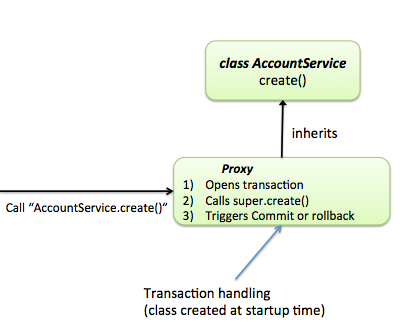

# Spring transaction

---

1. @Transactional
2. 예외가 발생했을 때?
3. Checked Exception / Unchecked Exception
4. 같은 클래스 내 `@Transactional`이 적용된 다른 메소드를 호출할 경우?
5. 다른 클래스 내에서 한쪽 메소드에만 `@Transactional`이 없는 경우
6. Propagation 전파
7. Isolation 격리

##### `spring-boot-transaction` project 참고

---

### 1. @Transactional

트랜잭션은 DB 명령어의 묶음
예로, `주문 → 결제` 는 순서대로 **하나의 작업**으로 진행되어 전부 성공하거나 전부 실패
Spring에서는 `@Transactional`이 사용된다. 클래스 또는 메소드에 해당 어노테이션을 붙여 트랜잭션 대상으로 설정한다.

##### 적용범위

클래스 위에 적용하면 각 메소드에 적용되고, 메소드 위에 적용할 수 있다. 이 경우에는 클래스보다 우선된다. `메소드 > 클래스`

##### 테스트

먼저 `@Transactional`이 무엇인지 `@Transactional` 을 미적용/적용하여 아래 TEST를 통해 알아본다. (각 save method마다 디버깅 브레이크 포인트를 걸어 확인해본다.)

#### TEST 1. @Transactional 미적용

```java
public boolean saveBoardAndHistory(Board board, History history) {
    boardRepository.save(board); // board 데이터 조회됨
    historyRepository.save(history); // history 데이터 조회됨
    return true;
}
```

save method가 호출되고 난 뒤에 바로 조회가 되는 것을 확인할 수 있는데, save method는 아래처럼 `@Transactional`이 적용되어 자체적으로 트랜잭션 생성하기 때문이다.

```java
@Transactional
@Override
public <S extends T> S save(S entity) {

    Assert.notNull(entity, "Entity must not be null.");

    if (entityInformation.isNew(entity)) {
        em.persist(entity);
        return entity;
    } else {
        return em.merge(entity);
    }
}
```

즉, **트랜잭션이 걸려있지만 않으면 각각 save method마다 트랜잭션이 동작**하게 된다.

#### TEST 2. @Transactional 적용

두 가지 board, history insert 쿼리는 한꺼번에 묶여서 하나의 트랜잭션으로 동작한다. **method가 시작될 때 `@Transaction`가 적용이 되며 method 호출이 완료되면 트랜잭션이 끝나 커밋되고 DB에 반영**된다.

```java
@Transactional
public boolean saveBoardAndHistoryWithTransactional(Board board, History history) {
    boardRepository.save(board);
    historyRepository.save(history);
    return true;
} // method 호출이 완료된 후 커밋되어 데이터가 조회됨
```

### 2. 예외가 발생했을 때?

#### TEST 1. @Transactional 미적용

당연히 트랜잭션이 잡혀있지 않아서 각 save method 마다 커밋이 발생하여 최종적으로 모든 테이블에 데이터가 insert된 걸 확인할 수 있다.

```java
public boolean save(Board board, History history) {
    boardRepository.save(board); // 데이터 저장
    historyRepository.save(history);  // 데이터 저장
    throw new RuntimeException("RuntimeException발생");
} // 최종적으로 커밋됨
```

#### TEST 2. @Transactional 적용

어노테이션 적용시 save 되지 않고 롤백 발생한다.

```java
@Transactional
public boolean saveWithTransactional(Board board, History history) {
    boardRepository.save(board);
    historyRepository.save(history);
    throw new RuntimeException("RuntimeException발생");
} // 롤백 발생
```

그렇다면 RuntimeException이 아닌 Checked Exception이 발생할 땐 어떻게 될까?

### 3. Checked Exception / Unchecked Exception

- Checked Exception(Expected): RuntimeException 하위 클래스를 제외한 Exception 하위 클래스 → 예외 처리 해야함
- Unchecked Exception(Unexpected): RuntimeException 하위 클래스 → 예외 처리 강제하지 않음

#### TEST 1. Checked Exception

```java
@Transactional
public boolean occurException(Board board, History history) throws Exception {
    boardRepository.save(board);
    historyRepository.save(history);
    throw new FileNotFoundException("Exception발생");
} // 커밋됨
```

`at org.springframework.transaction.interceptor.TransactionAspectSupport.invokeWithinTransaction(TransactionAspectSupport.java:388)` → `completeTransactionAfterThrowing` 로직을 탄다.
아래 메소드를 통해 롤백 하지 않고 커밋하도록 처리된 걸 확인할 수 있다.

```java
DefaultTransactionAttribute.class

@Override
public boolean rollbackOn(Throwable ex) {
    return (ex instanceof RuntimeException || ex instanceof Error);
}
```

롤백하고자 한다면 `@Transactional` 속성 중 `rollbackFor`을 사용한다.

```java
@Transactional(rollbackFor = Exception.class)
public boolean occurExceptionApplyRollbackFor(Board board, History history) throws Exception {
    boardRepository.save(board);
    historyRepository.save(history);
    throw new FileNotFoundException("Exception발생");
} // 롤백 발생
```

반대로 다른 경우가 발생하여 커밋을 하고자 한다면 `@Transactional` 속성 중 `noRollbackFor`을 사용한다.

즉,
**Checked Exception인 Expected Exception은 예상된 예외이므로 커밋이 발생하고, Unchecked Exception인 Unexpected Exception은 예상하지 못한 예외이므로 롤백이 발생한다.**

### 4. 같은 클래스 내 `@Transactional`이 적용된 다른 메소드를 호출할 경우?

#### TEST 1. update할 때?

```java
public boolean beforeSaveAndUpdateInSameClass(Board board, History history) {
    return this.saveAndUpdateWithTransactional(board, history);
}

@Transactional
public boolean saveAndUpdateWithTransactional(Board board, History history) {
    boardRepository.save(board);
    historyRepository.save(history);
    board.setTitle("TITLE2"); // update 되지 않음
    return true;
}
```

`TITLE2`로 update 되지 않고 기존의 board, history 값만 save된다.

#### TEST 2. RuntimeException이 발생했다면?

```java
public boolean beforeSave(Board board, History history) {
    return this.saveWithTransactional(board, history);
} // 커밋됨

@Transactional
public boolean saveWithTransactional(Board board, History history) {
    boardRepository.save(board);
    historyRepository.save(history);
    throw new RuntimeException("RuntimeException발생");
}
```

롤백이 될 것으로 예상했지만 커밋이 되었다. 위와 같은 사례로 보면 **같은 빈 내부에서 다른 메소드를 호출하면 그 어노테이션의 효과는 없다.**



1. Spring 내부에서 `@Transactional`이 적용된 메소드 또는 클래스들은 그 객체를 감싼 Proxy 객체를 생성한다. Proxy 객체는 대상 클래스를 상속하므로 `@Transactional`은 public method에 적용되어야한다.
2. Proxy를 통하여 객체를 다루게 되는데, TransactionManager를 주입받아 실행 메소드 앞 뒤 과정에 트랜잭션 시작, 트랜잭션 커밋 메소드를 설정하여 트랜잭션이 동작하도록 한다.
3. Proxy 객체로 접근하는 게 아닌 원 클래스의 `beforeSaveAndUpdateInSameClass` 메소드를 통해서 `saveAndUpdateWithTransactional`로 접근하게 되므로 해당 메소드에 적용된 `@Transactional`는 작동하지 않는다.

##### 해결방법

이 경우에는 아래처럼 **클래스를 따로 분리하여 호출**하도록 한다.

```java
public boolean beforeSaveAndUpdate(Board board, History history) {
    return basicOtherTxService.saveAndUpdateWithTransactional(board, history);
}

@Transactional
public boolean saveAndUpdateWithTransactional(Board board, History history) {
    boardRepository.save(board);
    historyRepository.save(history);
    board.setTitle("TITLE2"); // update 성공
    return true;
}
```

#### TEST 3. 두 트랜잭션 실행 중 RuntimeException 발생. 예외처리도 했다면?

##### 예외처리X

```java
// 다른 클래스로 분리
// RuntimeException 발생 -> board, history 모두 롤백
@Transactional
public boolean beforeSaveAndUpdateOccurException(Board board, History history) {
    boardRepository.save(board);
    return basicOtherTxService.saveAndUpdateWithTransactionalOccurException(board, history);
}

@Transactional
public boolean saveAndUpdateWithTransactionalOccurException(Board board, History history) {
    historyRepository.save(history);
    board.setTitle("TITLE2");
    throw new RuntimeException("RuntimeException");
}
```

RuntimeException이 발생하여 종료되며, **전부 롤백**된다.

##### 예외처리O

```java
@Transactional
public boolean beforeSaveAndUpdateTryCatch(Board board, History history) {
    boardRepository.save(board);
    try {
        basicOtherTxService.saveAndUpdateWithTransactionalOccurException(board, history);
    } catch (Exception e) {
        //
    }
    return true;
}
```

`Transaction silently rolled back because it has been marked as rollback-onlyorg.springframework.transaction.UnexpectedRollbackException: Transaction silently rolled back because it has been marked as rollback-only`
RuntimeException 발생시 rollback-only로 마크된다. try-catch문으로 예외를 핸들링하여 트랜잭션 완료 로직을 타도 최종커밋할 때는 앞서 마크된 rollback-only 때문에 **전부 롤백이 발생**한다.

### 5. 다른 클래스 내에서 한쪽 메소드에만 `@Transactional`이 없는 경우

#### TEST 1.

```java
@Transactional
public boolean beforeSaveAndUpdateWithTransactional(Board board, History history) {
    boardRepository.save(board);
    basicOtherTxService.saveAndUpdateOccurException(board, history);
    return true;
}

public boolean saveAndUpdateOccurException(Board board, History history) {
    historyRepository.save(history);
    board.setTitle("TITLE2");
    throw new RuntimeException("RuntimeException");
}
```

한 트랜잭션 내에서 RuntimeException 발생하였으므로 롤백 발생

#### TEST 2.

```java
public boolean beforeSaveAndUpdateWithoutTransactional(Board board, History history) {
    boardRepository.save(board);
    basicOtherTxService.saveAndUpdateWithTransactionalOccurException(board, history);
    return true;
}

@Transactional
public boolean saveAndUpdateWithTransactionalOccurException(Board board, History history) {
    historyRepository.save(history);
    board.setTitle("TITLE2");
    throw new RuntimeException("RuntimeException");
}
```

history는 롤백되나 board는 커밋된다. (단, `saveAndUpdateWithTransactionalOccurException`에서 RuntimeException이 발생하였으므로 롤백되어 `TITLE2`로 update 되지 않는다.)

그렇다면 기존에 트랜잭션이 실행되고 있는데, 다른 클래스의 `@Transactional`이 적용된 메소드를 호출할 경우 또 무엇을 고려할 수 있을까? → `Propagation`

### 6. Propagation 전파

트랜잭션이 실행되다가 중간에 다른 트랜잭션이 실행될 때 다양한 처리방식이 존재한다.
|type|description|
|--|--|
|REQUIRED|기본 전략. 상위 트랜잭션이 적용 되어있으면 사용하고 없으면 트랜잭션 생성. `save()`|
|REQUIRES_NEW|상위 트랜잭션 상관없이 트랜잭션 있든 없든 무조건 자체적으로 독립적인 트랜잭션 생성|
|NESTED|상위 트랜잭션에 종속적이지만 상위 트랜잭션에 영향을 주지 않는다.|
|MANDATORY|상위 트랜잭션 반드시 있어야하고 없으면 에러 발생|
|NEVER|상위 트랜잭션 없어야하고 존재시 에러 발생|
|SUPPORTS|상위 트랜잭션이 없으면 굳이 트랜잭션 생성하지 않음|
|NOT_SUPPORTED|상위 트랜잭션이 있으면 보류함|

- REQUIRES_NEW

```java
@Transactional
public boolean savePropagationRequiresNew(Board board, History history) {
    saveBoard(board);
    try {
        historyPropagationService.saveHistoryPropagationRequiresNew(history);
    } catch (Exception e) {
        //
    }
    return true;
}

@Transactional(propagation = Propagation.REQUIRES_NEW)
public History saveHistoryPropagationRequiresNew(History history) {
    history = historyRepository.save(history);
    throw new RuntimeException("RuntimeException발생. rollback");
}
```

```
assertThat(boardRepository.count()).isEqualTo(1);
assertThat(historyRepository.count()).isZero();
```

자체적으로 트랜잭션을 만들어 `saveHistoryPropagationRequiresNew()`에서 RuntimeException 발생할 경우 board는 커밋되지만 history는 롤백된 것을 알 수 있다.

- NESTED
  `상위 트랜잭션에 종속적이지만 상위 트랜잭션에 영향을 주지 않는다.`의 의미를 테스트를 통해 좀 더 알아본다.

##### 하위 트랜잭션 내 RuntimeException 발생

```java
@Transactional
public boolean savePropagationNested(Board board, History history) {
    saveBoard(board);
    try {
        historyPropagationService.saveHistoryPropagationNestOccureException(history);
    } catch (Exception e) {
        // 예외처리
    }
    return true;
}

@Transactional(propagation = Propagation.NESTED)
public History saveHistoryPropagationNestOccureException(History history) {
    history = historyRepository.save(history);
    throw new RuntimeException("RuntimeException발생. rollback");
}
```

```
assertThat(boardRepository.count()).isEqualTo(1);
assertThat(historyRepository.count()).isZero();
```

하위 트랜잭션 내에서 RuntimeException이 발생하면 history는 롤백되지만 예외 처리를 한 상위 트랜잭션 내에 영향을 미치지 않으므로 board는 커밋된다.

##### 상위 트랜잭션 내 RuntimeException 발생

```java
@Transactional
public boolean savePropagationNestedOccurException(Board board, History history) {
    saveBoard(board);
    historyPropagationService.saveHistoryPropagationNest(history);
    throw new RuntimeException("RuntimeException 발생");
}
@Transactional(propagation = Propagation.NESTED)
public History saveHistoryPropagationNest(History history) {
    return historyRepository.save(history);
}
```

```
assertThat(boardRepository.count()).isZero();
assertThat(historyRepository.count()).isZero();
```

상위 트랜잭션 내에서 RuntimeException이 발생하면 board, history 모두 롤백이 발생한다.

> 의문점?
> Spring 내 NESTED 설명은 아래와 같다.
> Actual creation of a nested transaction will only work on specific transaction managers. Out of the box, this only applies to the JDBC DataSourceTransactionManager. Some JTA providers might support nested transactions as well.
> → JpaTransacionManager로는 작동이 안되는 것 같은데 테스트는 돌아간다. 테스트가 잘못된건가?

### 7. Isolation 격리

한 트랜잭션 이외에 다른 트랜잭션이 발생하여 해당 데이터 접근을 어떻게 처리할지 다양한 방식이 존재한다.
한 트랜잭션은 테스트 코드, 다른 트랜잭션은 직접 쿼리를 날려 테스트 해본다.
`start transaction; → update문 → commit/rollback;`
아래쪽으로 갈 수록 격리 강도 증가, 데이터 정합성 보장, 성능 감소
|type|description|
|--|--|
|DEFAULT|기본 전략. 첫번째 트랜잭션 도중에 두번째 트랜잭션으로 데이터를 변경했지만 조회되지 않고 첫번째 트랜잭션이 완료되면 조회됨|
|READ_UNCOMMITTED|커밋하지 않아도 데이터 조회가 됨. `dirty read` 발생|
|READ_COMMITTED|커밋된 데이터만 조회할 수 있음. |
|REPEATABLE_READ|동일한 값을 조회할 수 있도록 보장|
|SERIALIZABLE|커밋이 발생하지 않은 트랜잭션은 LOCK이 걸린다. 성능 떨어짐|

##### READ_UNCOMMITTED

- `A 트랜잭션 시작 → B 트랜잭션에서 트랜잭션 시작한 후 update → A 트랜잭션 내에서 update → B 트랜잭션 롤백`

이미 Entity가 가지고 있는 (B 트랜잭션에서 발생한)데이터가 update 된다. → Entity에 `@DynamicUpdate` 추가하여 해결한다.

```
Hibernate:
   update
       board
   set
       content=?,
       created_at=?,
       title=?,
       updated_at=?,
       writer=?
   where
       id=?
```

##### READ_COMMITTED

- @DynamicUpdate 사용하지 않아도 dirty read 현상은 발생하지 않는다.
- `A 트랜잭션 시작 → B 트랜잭션에서 트랜잭션 시작한 후 update → A 트랜잭션 내에서 update → B 트랜잭션 커밋`

영속성 컨텍스트에서 관리하는 Entity Cache 때문에 새롭게 업데이트 된 값을 조회하지 못한다. 커밋했지만 A 트랜잭션에서 update한 값만 조회된다.
EntityManager를 주입하여 영속성 컨텍스트를 clear 해도 트랜잭션 내에서 반복적으로 조회시 값이 변경 될 수 있는 `unRepeatableRead` 발생한다.

##### REPEATABLE_READ

트랜잭션 시작할 때 조회 데이터를 별도로 저장해두고 트랜잭션 끝나기 전까지 그 값을 리턴해줘(스냅샷), 반복적으로 조회해도 항상 동일한 값이 나오도록 해준다.
`Phantom read` 현상 발생

---

> https://www.baeldung.com/transaction-configuration-with-jpa-and-spring
https://techblog.woowahan.com/2606/ 
https://mommoo.tistory.com/92 https://www.podo-dev.com/blogs/133 
https://static.podo-dev.com/blogs/images/2019/07/10/origin/I8ECVM190222205849.PNG
